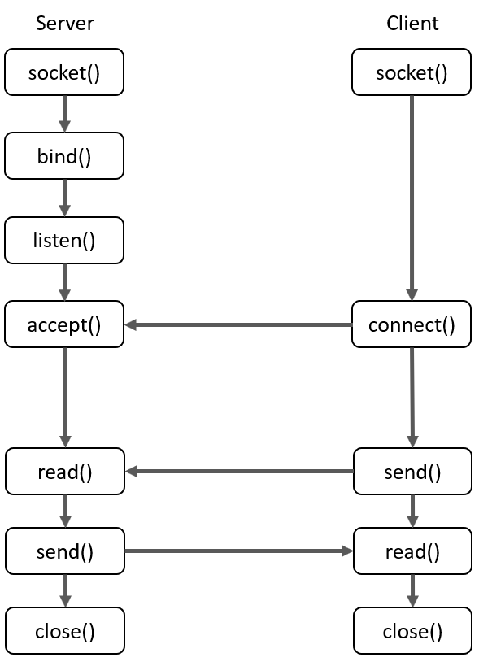

# Socket Server

A C++ implementation of a simple network [TCP](https://en.wikipedia.org/wiki/Transmission_Control_Protocol)   socket server. Clients can connect to this server via IP & PORT. 

***NOTE:** This server only works in a linux environment!*


<p align="center">
	
</p>

## Requirements
C++11

GCC

Linux environment

## Usage
An example usage can be found in main.cpp

```
#include <iostream>
#include <thread>
#include "ServerSocket.h"
#include "Socket.h"

void handle(net::Socket* client) {
	std::cout << "Client connected! fd: " << client->socketfd << std::endl;
	while (true) {
		std::string msg;
		if (client->read(msg) <= 0) {
			break;
		}
		std::cout << "Client " << client->socketfd << " said: " << msg;
	}
	delete client;
	std::cout << "Client " << client->socketfd << " disconnected" << std::endl;
}


int main(int argc, char **argv) {
	net::ServerSocket* server = new net::ServerSocket("127.0.0.1", 8080, 1);

	int err = server->listen();
	if (err != 0) {
		std::cout << strerror(err) << std::endl;
		exit(err);
	}

	std::thread server_thread([&server](){
		while (true) {
			std::cout << "Waiting for a client.." << std::endl;
			net::Socket* client = server->accept();
			if (!client->valid()) {
				delete client;
				continue;
			}
			std::thread* t_read = new std::thread(handle, client);
		}
	});
	server_thread.join();

	delete server;
	return 0;
}
```

---

Credit to [davidsteinsland](https://github.com/davidsteinsland) for the blueprint